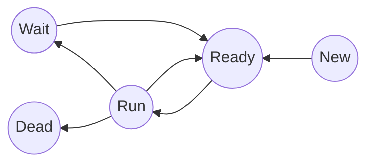

## Scheduling

### Tache :

* Deadline
* Temp d’exec
* Dépendances
* (Priorité)

### Batch

* Turnaround time
* Throughtput

Taches plus longues = plus tard

* FCFS first come first serve
* STF shortest first

Time-sharing

* Plusieurs taches en même temps

bottleneck

* cpu bound
* io bound
* memory bound